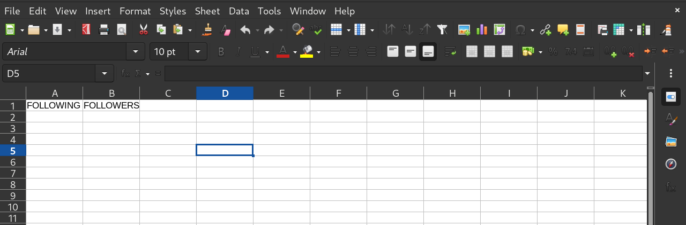
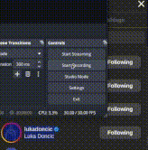
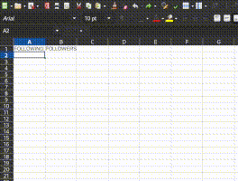

# Instagram Follower List
Python script that creates a list of users you follow that don't follow you back.
# Step 1
## This program needs this dependencies:
- pandas
- openpyxl

In order to install this dependencies you have to make sure you are on the InstaFollowList directory

## Run this on your terminal in order to install all dependencies

This creates a virtual enviroment
```
python3 -m venv venv
source venv/bin/activate
```

This install all requirements
```
pip install -r requirements.txt
```
# Step 2
Open the data.xlsx file on LibreOffice or Microsoft Excel, you will see 2 cells called FOLLOWERS and FOLLOWING




**DO NOT TO CHANGE THE NAME OF THIS CELLS**

# Step 3
## Login on your instagram account on your favorite browser
## Go to your profile and click on following/followers

You need to **COPY THE WHOLE LIST OF FOLLOWING / FOLLOWERS** as shown below



### IMPORTANT
**Remember to copy all the images aswell**

# Step 4
### Paste the content on the corresponding cell **-WITHOUT FORMAT-**



# Step 5

Run "InstaFollowList.py" on your terminal using:
```
python3 InstaFollowList.py
```
This will create a file called **results.txt**, inside you will see the usernames of the people who don't follow you back